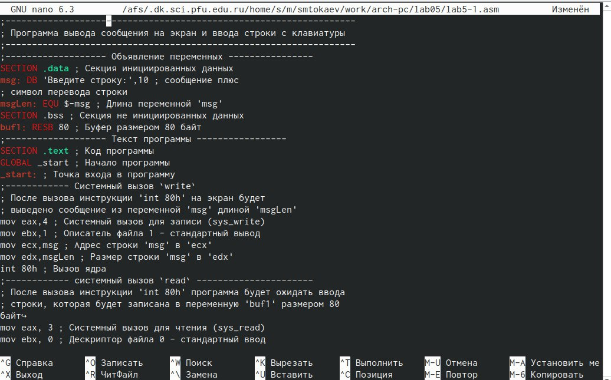

---
## Front matter
title: "Отчёт по лабораторной работе №5"
subtitle: "Основы работы с Midnight Commander (mc), cтруктура программы на языке ассемблера NASM  и системные вызовы в ОС GNU Linux"
author: "Степан Михайлович Токаев"

## Generic otions
lang: ru-RU
toc-title: "Содержание"

## Bibliography
bibliography: bib/cite.bib
csl: pandoc/csl/gost-r-7-0-5-2008-numeric.csl

## Pdf output format
toc: true # Table of contents
toc-depth: 2
lof: true # List of figures
lot: true # List of tables
fontsize: 12pt
linestretch: 1.5
papersize: a4
documentclass: scrreprt
## I18n polyglossia
polyglossia-lang:
  name: russian
  options:
	- spelling=modern
	- babelshorthands=true
polyglossia-otherlangs:
  name: english
## I18n babel
babel-lang: russian
babel-otherlangs: english
## Fonts
mainfont: PT Serif
romanfont: PT Serif
sansfont: PT Sans
monofont: PT Mono
mainfontoptions: Ligatures=TeX
romanfontoptions: Ligatures=TeX
sansfontoptions: Ligatures=TeX,Scale=MatchLowercase
monofontoptions: Scale=MatchLowercase,Scale=0.9
## Biblatex
biblatex: true
biblio-style: "gost-numeric"
biblatexoptions:
  - parentracker=true
  - backend=biber
  - hyperref=auto
  - language=auto
  - autolang=other*
  - citestyle=gost-numeric
## Pandoc-crossref LaTeX customization
figureTitle: "Рис."
tableTitle: "Таблица"
listingTitle: "Листинг"
lofTitle: "Список иллюстраций"
lotTitle: "Список таблиц"
lolTitle: "Листинги"
## Misc options
indent: true
header-includes:
  - \usepackage{indentfirst}
  - \usepackage{float} # keep figures where there are in the text
  - \floatplacement{figure}{H} # keep figures where there are in the text
---

# Цель работы

Приобретение практических навыков работы в Midnight Commander и освоение инструкций языка ассемблера mov и int.

# Выполнение лабораторной работы

1. Открываем Midnight Commander.

{ #fig:001 width=90% }

2. Переходим в каталог ~/work/arch-pc и создаем папку lab05.

{ #fig:002 width=90% }

3. Создаем файл lab5-1.asm.

{ #fig:003 width=90% }

4. Открываем файл lab5-1.asm для редактирования и вводим текст программы, сохраняем изменения и закрываем файл.

{ #fig:004 width=90% }

5. Открываем файл lab5-1.asm для просмотра. Убеждаемся, что файл содержит текст программы.

{ #fig:005 width=90% }

6. Оттранслируем текст программы lab5-1.asm в объектный файл, выполним компоновку объектного файла и запустим получившийся исполняемый файл.

{ #fig:006 width=90% }

7. Скачаем файл in_out.asm со страницы курса в ТУИС и скопируем файл in_out.asm в каталог с файлом lab5-1.asm.

{ #fig:007 width=90% }

8. Создаем копию файла lab5-1.asm с именем lab5-2.asm.

{ #fig:008 width=90% }

9. Исправим текст программы в файле lab5-2.asm.

{ #fig:009 width=90% }

10. Создаем исполняемый файл и проверяем его работу.

{ #fig:010 width=90% }

11. Заменяем подпрограмму sprintLF на sprint в файле lab5-2.asm.

{ #fig:011 width=90% }

12. Создаем исполняемый файл и проверяем его работу.

{ #fig:012 width=90% }

Разница в том, что подпрограмма sprintLF переводит сообщение на следующую
строку, а sprint данного действия не делает.

13. Создаем копию файла lab5-1.asm и вносим изменения в программу.

{ #fig:013 width=90% }

{ #fig:014 width=90% }

14. Получаем исполняемый файл и проверяем его работу.

{ #fig:015 width=90% }

15. Создаем копию файла lab5-2.asm и вносим изменения в программу.

{ #fig:016 width=90% }

{ #fig:017 width=90% }

16. Получаем исполняемый файл и проверяем его работу.

{ #fig:018 width=90% }

# Выводы

В ходе выполнения лабораторной работы я приобретёл практические навыки работы в Midnight Commander и освоил инструкции языка ассемблера mov и int.

