---
## Front matter
title: "Отчёт по лабораторной работе №6"
subtitle: "Арифметические операции в NASM."
author: "Степан Михайлович Токаев"

## Generic otions
lang: ru-RU
toc-title: "Содержание"

## Bibliography
bibliography: bib/cite.bib
csl: pandoc/csl/gost-r-7-0-5-2008-numeric.csl

## Pdf output format
toc: true # Table of contents
toc-depth: 2
lof: true # List of figures
lot: true # List of tables
fontsize: 12pt
linestretch: 1.5
papersize: a4
documentclass: scrreprt
## I18n polyglossia
polyglossia-lang:
  name: russian
  options:
	- spelling=modern
	- babelshorthands=true
polyglossia-otherlangs:
  name: english
## I18n babel
babel-lang: russian
babel-otherlangs: english
## Fonts
mainfont: PT Serif
romanfont: PT Serif
sansfont: PT Sans
monofont: PT Mono
mainfontoptions: Ligatures=TeX
romanfontoptions: Ligatures=TeX
sansfontoptions: Ligatures=TeX,Scale=MatchLowercase
monofontoptions: Scale=MatchLowercase,Scale=0.9
## Biblatex
biblatex: true
biblio-style: "gost-numeric"
biblatexoptions:
  - parentracker=true
  - backend=biber
  - hyperref=auto
  - language=auto
  - autolang=other*
  - citestyle=gost-numeric
## Pandoc-crossref LaTeX customization
figureTitle: "Рис."
tableTitle: "Таблица"
listingTitle: "Листинг"
lofTitle: "Список иллюстраций"
lotTitle: "Список таблиц"
lolTitle: "Листинги"
## Misc options
indent: true
header-includes:
  - \usepackage{indentfirst}
  - \usepackage{float} # keep figures where there are in the text
  - \floatplacement{figure}{H} # keep figures where there are in the text
---

# Цель работы

Освоение арифметических инструкций языка ассемблера NASM.

# Выполнение лабораторной работы

1. Создадим каталог для программам лабораторной работы No 6, перейдём в него и создадим файл lab6-1.asm

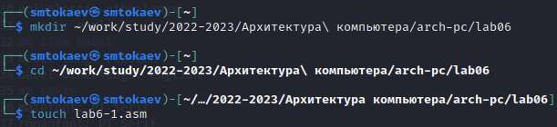{ #fig:001 width=90% }

2. Введём в файл lab6-1.asm текст программы из листинга 7.1

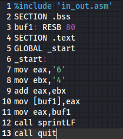{ #fig:002 width=90% }

3. Создадим исполняемый файл и запустим его.

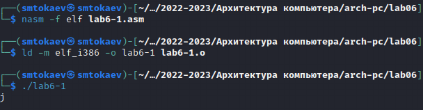{ #fig:003 width=90% }

4. Изменим текст программы и вместо символов, запишем в регистры числа.

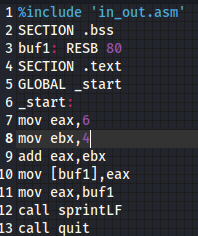{ #fig:004 width=90% }

5. Создадим исполняемый файл и запустим его. 

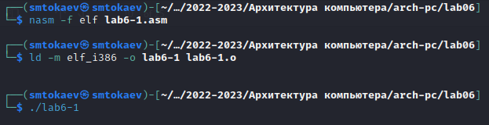{ #fig:005 width=90% }

Данный символ не выводится на экран

6. Создадим файл lab6-2.asm и введём в него текст программы из листинга 6.2.

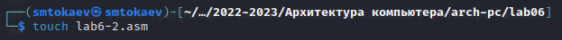{ #fig:006 width=90% }

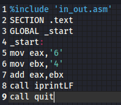{ #fig:007 width=90% }

7. Создайте исполняемый файл и запустите его.

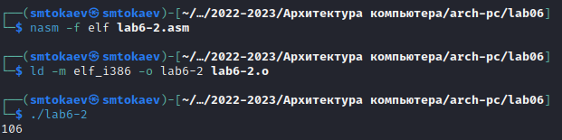{ #fig:008 width=90% }

8. Заменим символы на числа.

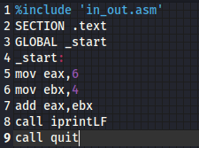{ #fig:009 width=90% }

9. Создадим исполняемый файл и запустим его. В результате получили число 10.

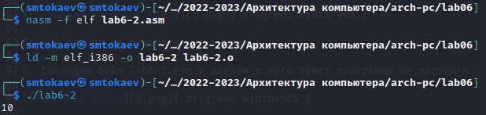{ #fig:010 width=90% }

10. Заменим функцию iprintLF на iprint, создадим исполняемый файл и запустим его. Вывод функций iprintLF и iprint отличается наличием перевода строки

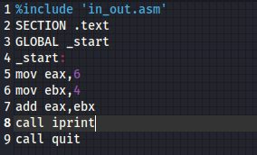{ #fig:011 width=90% }

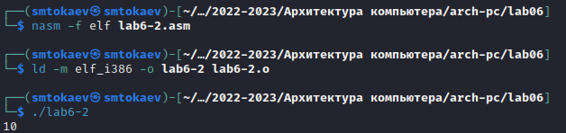{ #fig:012 width=90% }

11. Создадим файл lab6-3.asm.

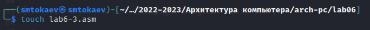{ #fig:013 width=90% }

12. Введём в lab6-3.asm текст программы из листинга 7.3 

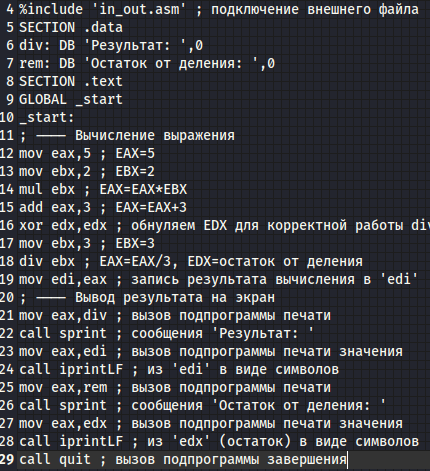{ #fig:014 width=90% }

13. Создадим исполняемый файл и запустим его.

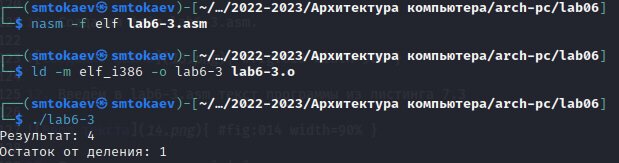{ #fig:015 width=90% }

14. Изменим текст программы для вычисления выражения 𝑓(𝑥) = (4 ∗ 6 + 2)/5. Создадим исполняемый файл и проверим его работу.

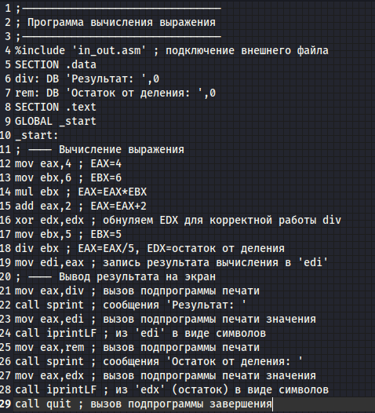{ #fig:016 width=90% }

{ #fig:017 width=90% }

15. Создадим файл variant.asm для вычисления варианта задания по номеру студенческого билета. 

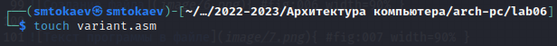{ #fig:018 width=90% }

16. введём в файл variant.asm текст программы из листинга 7.4

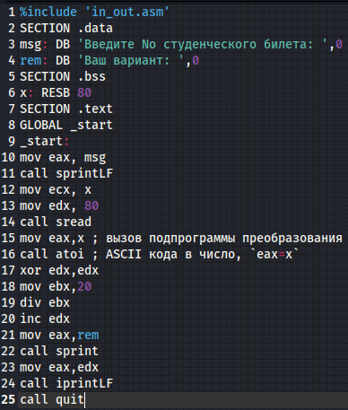{ #fig:019 width=90% }

17. Создадим исполняемый файл и запустим его. Результат работы программы вычислил номер варианта - 8.

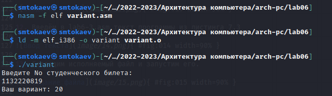{ #fig:020 width=90% }

# Ответы на вопросы по программе

1. За вывод сообщения “Ваш вариант” отвечают строки кода:

mov eax,rem
call sprint

2. Инструкция mov ecx, x используется, чтобы положить адрес вводимой стро-
ки x в регистр ecx mov edx, 80 - запись в регистр edx длины вводимой строки
call sread - вызов подпрограммы из внешнего файла, обеспечивающей ввод
сообщения с клавиатуры

3. сall atoi используется для вызова подпрограммы из внешнего файла, кото-
рая преобразует ascii-код символа в целое число и записывает результат в
регистр eax

4. За вычисления варианта отвечают строки:

xor edx,edx ; обнуление edx для корректной работы div
mov ebx,20 ; ebx = 20
div ebx ; eax = eax/20, edx - остаток от деления
inc edx ; edx = edx + 1

5. При выполнении инструкции div ebx остаток от деления записывается в
регистр edx

6. Инструкция inc edx увеличивает значение регистра edx на 1

7. За вывод на экран результатов вычислений отвечают строки:

mov eax,edx
call iprintLF

# Выполнение заданий для самостоятельной работы

1. Создадим файл variant-2.asm

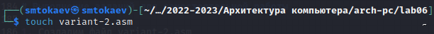{ #fig:021 width=90% }

2. Вводим текст программы для вычисления значения выражения из варианта 20

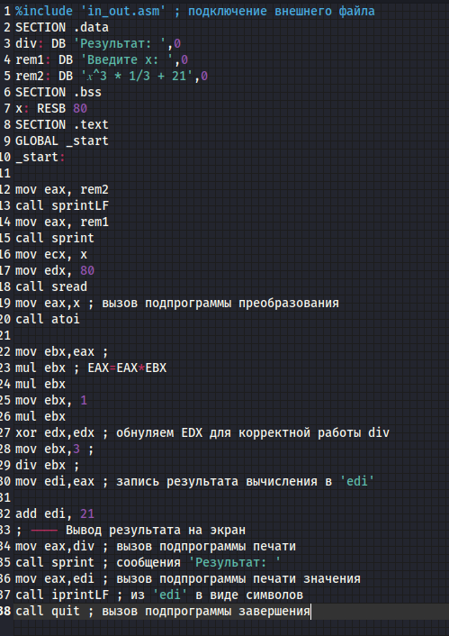{ #fig:022 width=90% }

3. Создадим исполняемый файл и проверим его работу для значений x1 = 1 и x2 = 3.

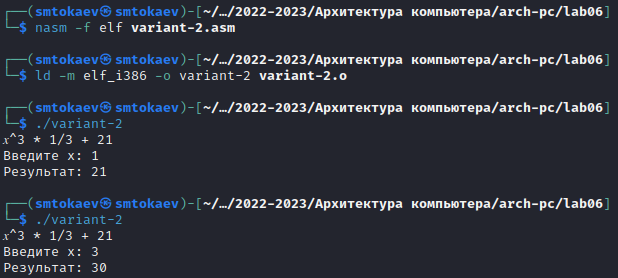{ #fig:023 width=90% }

# Вывод

При выполнении данной лабораторной работы я освоил арифметические
инструкции языка ассемблера NASM.
Здесь кратко описываются итоги проделанной работы.

